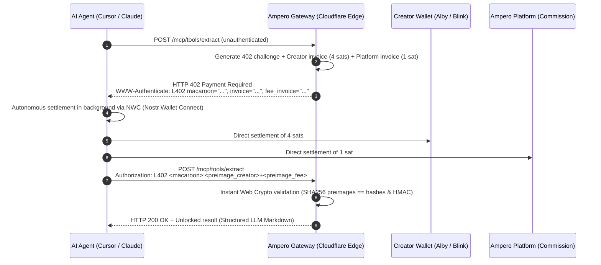

# ⚡ Ampero

> **Edge-Native Machine-to-Machine (M2M) Micro-Payment Infrastructure & Model Context Protocol (MCP) Gateway**  
> *Monetize your MCP tools in 1 line of code. Enable AI agents to pay autonomously in satoshis.*

[](https://www.typescriptlang.org/)
[](https://workers.cloudflare.com/)
[](https://github.com/lightning/blips/blob/master/blip-0004.md)
[](https://modelcontextprotocol.io)
[](LICENSE)
[]()

---

## 💡 Why Ampero?

Traditional payment rails (Stripe, credit cards, \$20/month SaaS plans) break down for autonomous AI agents:
* **Prohibitive fixed fees:** \$0.30 + 2.9% per charge. When an agent calls a tool costing \$0.003 (5 sats), Stripe fees cost **100x more** than the actual compute!
* **Banking friction & KYC:** Autonomous software agents do not hold national IDs, corporate bank accounts, or smartphones to pass 3D-Secure / OTP SMS verification.
* **Reviving open web standards:** Ampero revives the web's native **HTTP 402 Payment Required** status code and the **L402** (bLIP-0004) protocol powered by the **Bitcoin Lightning Network**.

Satoshis serve as **programmable network fluid**, settling value directly from machine to machine in sub-second latency.

---

## 🏗️ M2M Architecture (Execution Flow)



---

## ✨ Key Features

* **Zero Creator Friction:** Simply specify your **Lightning Address** (e.g., `creator@getalby.com`). No Lightning node setup or maintenance required.
* **100% Non-Custodial (Zero Regulatory Overhead):** Ampero never custodies third-party funds. Micro-payments settle directly into creator wallets.
* **Atomic Dual-Invoice Split:** The platform earns its commission (e.g., 5%) via cryptographic caveats verified simultaneously in constant time.
* **Edge-Native Performance:** Pure **Web Crypto API** (HMAC-SHA256 Macaroons v1 and zero-dependency BOLT-11 Bech32 parser) running worldwide in < 1 ms on Cloudflare Workers V8 isolates.
* **Dual Protocol Support:** Compatible with standard REST endpoints as well as the official **Model Context Protocol (MCP) JSON-RPC 2.0** specification.
* **Agentic Discovery Engine:**
  * Standardized `/llms.txt` route for LLM indexing and crawler ingestion.
  * Auto-explaining HTTP 402 challenge guidance (`llm_instruction`).
  * Free built-in meta-tool `discover_tools` (0 sats) for runtime catalogue search.
* **Built-in Financial Guardrails:** Per-request spending limits (`maxSatsPerRequest`) and session budgets (`sessionBudgetSats`) with structured audit logs.

---

## 🚀 Quickstart

### 1. Monetize an MCP Tool in 1 Line of Code

Using the official `@modelcontextprotocol/sdk`:

```typescript
import { McpServer } from '@modelcontextprotocol/sdk/server/mcp.js';
import { z } from 'zod';
import { registerMonetizedTool } from 'ampero';

const server = new McpServer({ name: 'MyMonetizedServer', version: '1.0.0' });

// ⚡ Automatic monetization via Lightning Address
registerMonetizedTool(
  server,
  'extract_clean_markdown',
  'Extracts and sanitizes any webpage into clean Markdown for LLMs',
  { url: z.string().url() },
  {
    priceSats: 5,
    lightningAddress: 'creator@getalby.com'
  },
  async (args, extra) => {
    // extra.l402 contains { paymentHash, preimage, costSats }
    return {
      content: [{ type: 'text', text: `# Extracted data for ${args.url}` }]
    };
  }
);
```

---

### 2. Consume Paid Tools with an Autonomous AI Agent

Drop-in replacement for standard `fetch`:

```typescript
import { createL402Fetch } from 'ampero';

const l402Fetch = createL402Fetch({
  // Agent Nostr Wallet Connect (NWC) URI
  nwcUrl: 'nostr+walletconnect://<pubkey>?relay=wss://relay.damus.io&secret=<secret>',
  
  // Financial guardrails
  maxSatsPerRequest: 10,   // Max 10 sats per request
  sessionBudgetSats: 500,  // Max budget for the entire session

  onPayment: (log) => {
    console.log(`[Ampero] Settled ${log.costSats} sats for ${log.url}`);
  }
});

// Transparent execution: 402 is intercepted, settled via NWC, and retried in ~200 ms
const response = await l402Fetch('https://ampero.dev/mcp/tools/extract', {
  method: 'POST',
  body: JSON.stringify({ url: 'https://bitcoin.org' })
});

const data = await response.json();
console.log(data);
```

---

### 3. Claude Desktop & Cursor Integration

Add Ampero to your `claude_desktop_config.json`:

```json
{
  "mcpServers": {
    "ampero-tools": {
      "command": "npx",
      "args": [
        "-y",
        "ampero",
        "client",
        "--endpoint",
        "https://ampero.dev/mcp"
      ]
    }
  }
}
```

---

### 4. Autonomous Agent Discovery (`/llms.txt` & `discover_tools`)

- **LLM Context Ingestion:** Point any LLM agent or crawler to `https://ampero.dev/llms.txt` to discover Ampero capabilities, integration examples, and currently registered tools.
- **Runtime Discovery Meta-Tool (0 sats):** Any AI agent can search the tool catalogue for free by calling `discover_tools` via JSON-RPC:
  ```json
  {
    "name": "discover_tools",
    "arguments": {
      "query": "markdown",
      "max_price_sats": 10
    }
  }
  ```

---

## 🧪 Local Testing & Developer Playground

Start the local Cloudflare Workers emulator:

```bash
npm install
npm run dev
```

Open your browser at **`http://localhost:8787`**:
1. Explore the **Interactive Showcase & Developer Playground**.
2. Click **"Trigger M2M Request"** to inspect the live HTTP 402 handshake.
3. Settle 5 sats in 1 click using **Alby (WebLN)** or click **"Simulate Autonomous NWC Settlement"** to test without spending real funds.

---

## 📦 Repository Structure

```
ampero/
├── src/
│   ├── index.ts                # Cloudflare Worker entry point, REST routes & MCP gateway
│   ├── l402/
│   │   ├── macaroon.ts         # Macaroons v1 engine (Pure Web Crypto HMAC-SHA256)
│   │   ├── middleware.ts       # L402 middleware (402 challenge, caveats & atomic split)
│   │   ├── replay.ts           # Anti-replay stores (Memory & Cloudflare KV)
│   │   └── types.ts            # L402 TypeScript protocol definitions
│   ├── lightning/
│   │   ├── bolt11.ts           # BOLT-11 / Bech32 decoder (payment_hash & amount extractor)
│   │   └── lnurl.ts            # LNURL-pay / Lightning Address (LUD-16) client
│   ├── mcp/
│   │   ├── wrapper.ts          # Higher-Order Function withL402Tool (1-line monetization)
│   │   ├── router.ts           # Edge JSON-RPC 2.0 router (tools/list & tools/call)
│   │   ├── adapter.ts          # Official @modelcontextprotocol/sdk McpServer adapter
│   │   └── errors.ts           # L402PaymentRequiredError with LLM guidance
│   ├── client/
│   │   ├── fetch.ts            # Drop-in L402 fetch with automatic 402 interception
│   │   ├── mcp-client.ts       # Autonomous MCP client for AI agents
│   │   └── nwc.ts              # Nostr Wallet Connect (NIP-47) client
│   ├── tools/
│   │   ├── deep-extractor.ts   # Monetized tool: Sanitized web markdown for LLMs (5 sats)
│   │   └── mempool-fees.ts     # Monetized tool: Live Bitcoin mempool fees (2 sats)
│   └── ui/
│       ├── playground.ts       # Tailwind CSS developer playground & showcase UI
│       └── llms-txt.ts         # Standard /llms.txt generator for LLM discovery
└── test/                       # 40 comprehensive unit tests (Vitest)
```

---

## 🛡️ Test Suite

Run the full automated test suite:

```bash
npm test
```

```
 ✓ test/macaroon.test.ts (4 tests)
 ✓ test/deep-extractor.test.ts (3 tests)
 ✓ test/mcp-router.test.ts (4 tests)
 ✓ test/mcp-wrapper.test.ts (5 tests)
 ✓ test/middleware.test.ts (5 tests)
 ✓ test/client-mcp.test.ts (2 tests)
 ✓ test/client-fetch.test.ts (4 tests)
 ✓ test/split-payment.test.ts (3 tests)
 ✓ test/registry-submit.test.ts (2 tests)
 ✓ test/agent-discovery.test.ts (3 tests)
 ✓ test/mcp-adapter.test.ts (1 test)
 ✓ test/bolt11.test.ts (4 tests)

Test Files  12 passed (12)
     Tests  40 passed (40)
```

---

## 📜 License

Released under the **MIT License**. Built to unlock the autonomous machine-to-machine economy.
