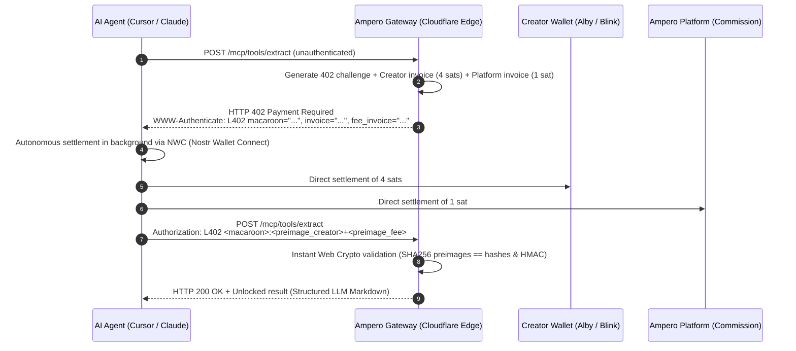

# ⚡ Ampero

> **The Visa Network for Autonomous AI Agents & Specialized Models**  
> *Powered by Bitcoin Lightning (L402 / HTTP 402). Monetize compute, tools, and fine-tuned SLMs in 1 line of code.*

[](https://www.typescriptlang.org/)
[](https://workers.cloudflare.com/)
[](https://github.com/lightning/blips/blob/master/blip-0004.md)
[](https://modelcontextprotocol.io)
[](LICENSE)
[]()

---

## 💡 Why Ampero?

> **"Visa connected human consumers to merchants with credit cards. Ampero connects autonomous AI agents to hyper-specialized expert models with Bitcoin satoshis."**  
>
> The era of a single monolithic model doing everything is over. The future of AI belongs to general orchestrators (Claude, GPT) querying thousands of **hyper-specialized expert models** (fine-tuned 8B SLMs on Hugging Face, domain tools, custom compute). Ampero enables agents to pay 5 satoshis per inference on demand, turning GPU cost centers into self-funding, profitable assets with zero human friction.

Traditional payment rails (credit cards, bank accounts, \$20/month SaaS subscriptions) fail for autonomous AI agents:
* **Prohibitive fixed fees:** \$0.30 + 2.9% per charge. When an agent calls a specialized model costing \$0.003 (5 sats), credit card fees cost **100x more** than the actual compute!
* **No subscription fatigue:** Nobody can maintain 50 separate SaaS subscriptions for 50 specialized models called occasionally.
* **Banking friction & KYC:** Autonomous software agents do not hold national IDs, corporate bank accounts, or smartphones to pass 3D-Secure SMS OTP verification.
* **Reviving open web standards:** Ampero revives the web's native **HTTP 402 Payment Required** status code and the **L402** (bLIP-0004) protocol powered by the **Bitcoin Lightning Network**.

Satoshis serve as **programmable network fluid**, settling value directly from machine to machine in sub-second latency.

📖 **Want to explore the broader thesis?** Read our manifesto: **[The Autonomous Machine Economy & Specialized Models (docs/VISION.md)](docs/VISION.md)**.

---

## ⚡ Real-World Bitcoin Utility: The Native Currency of AI Agents

Beyond speculation and store of value, **Bitcoin is the only monetary rail capable of powering the autonomous agentic economy**:

1. **Permissionless Machine Autonomy:** An AI agent cannot open a bank account, sign a merchant agreement, or provide KYC documents. With Bitcoin Lightning, any agent holding a cryptographic key can send and receive value instantly.
2. **Sub-Cent Micro-Transactions:** Compute tasks, single API queries, and web scrapes cost fractions of a cent (\$0.0005 to \$0.01). Satoshis provide the granular accounting unit needed for true pay-per-query machine economics.
3. **Sub-Second Finality (< 250ms):** Lightning Network payments settle instantly through off-chain routed channels without waiting for block confirmations or risking mempool fee spikes.
4. **Non-Custodial Bearer Value:** Payments travel directly from the agent's wallet to the creator's Lightning Address (`creator@getalby.com`). No intermediaries, no chargebacks, no account freezing.

### 📊 Payment Rails Comparison for AI Agents

| Capability | Credit Cards / Stripe | Smart Contract Chains (ETH/SOL) | Bitcoin Lightning (Ampero L402) |
| :--- | :--- | :--- | :--- |
| **Minimum Economic Unit** | ~\$0.50 (due to \$0.30 fixed fee) | \$0.01 – \$5.00+ (Gas fee fluctuations) | **\$0.0006 (1 satoshi)** |
| **Settlement Latency** | 2–5 days (bank payouts) | Seconds to minutes (block confirmations) | **< 250 ms (instant channel settlement)** |
| **Agent Autonomy** | ❌ Impossible (Requires human KYC & bank) | ⚠️ Complex gas management & bridging | **✅ Native (Bearer Macaroon + NWC wallet)** |
| **Web Standard Alignment** | ❌ Proprietary closed APIs | ❌ Custom Web3 RPCs | **✅ HTTP 402 Payment Required (RFC standard)** |
| **Custody & Regulatory Risk** | ⚠️ Intermediary custody & chargebacks | ⚠️ Smart contract exploits & tokens | **✅ 100% Non-Custodial (Direct Lightning Address)** |

---

## 🏗️ M2M Architecture (Execution Flow)



---

## ✨ Key Features

* **Zero Creator Friction:** Simply specify your **Lightning Address** (e.g., `creator@getalby.com`). No Lightning node setup or maintenance required.
* **100% Non-Custodial (Zero Regulatory Overhead):** Ampero never custodies third-party funds. Micro-payments settle directly into creator wallets.
* **Atomic Dual-Invoice Split:** The platform earns its commission (e.g., 5%) via cryptographic caveats verified simultaneously in constant time.
* **Edge-Native Performance:** Pure **Web Crypto API** (HMAC-SHA256 Macaroons v1 and zero-dependency BOLT-11 Bech32 parser) running worldwide in < 1 ms on Cloudflare Workers V8 isolates.
* **Dual Protocol Support:** Compatible with standard REST endpoints as well as the official **Model Context Protocol (MCP) JSON-RPC 2.0** specification.
* **Agentic Discovery Engine:**
  * Standardized `/llms.txt` route for LLM indexing and crawler ingestion.
  * Auto-explaining HTTP 402 challenge guidance (`llm_instruction`).
  * Free built-in meta-tool `discover_tools` (0 sats) for runtime catalogue search.
* **Self-Funding Open-Source AI (Hugging Face / SLMs):** Turn Hugging Face Spaces and fine-tuned models from GPU cost centers into profitable, self-funding autonomous assets. Micro-payments cover hosting costs on demand.
* **Built-in Financial Guardrails:** Per-request spending limits (`maxSatsPerRequest`) and session budgets (`sessionBudgetSats`) with structured audit logs.

---

## ⚡ Getting a Lightning Account (Under 60 Seconds)

You do **not** need to run a physical node, manage liquidity channels, or buy specialized hardware. Receiving and spending satoshis is as frictionless as using an email address.

### 1. For Tool Creators: Receive Satoshis (Free in 30s)
To monetize your MCP tools and APIs, you only need a **Lightning Address** (format: `username@domain.com`):
* **[Alby Account](https://getalby.com)** *(Recommended for developers)* — Web extension & developer hub. Provides an instant `yourname@getalby.com` Lightning Address in 30 seconds.
* **[Blink Wallet](https://www.blink.sv/)** *(Mobile)* — Fast mobile wallet with instant `yourname@blink.sv` Lightning Address.
* **[CoinOS](https://coinos.io)** *(Web)* — Simple web-based Bitcoin/Lightning wallet with custom address.
* **Self-Hosted / Sovereign:** Run [Alby Hub](https://albyhub.com), [Umbrel](https://umbrel.com), or your own LND/CLN node to connect your self-sovereign Lightning address with zero third-party dependencies.

### 2. For AI Agents: Autonomous Funding via NWC (Nostr Wallet Connect)
To grant an autonomous agent permission to pay micro-invoices in the background without human intervention:
1. In your Alby account (or Alby Hub), navigate to **Connections** &rarr; **Add Connection** (NWC / NIP-47).
2. Define a strict spending limit for your agent (e.g., max 500 sats/day, max 20 sats/call).
3. Copy the generated connection string (`nostr+walletconnect://...`).
4. Provide it to `createL402Fetch({ nwcUrl })`. Your agent now has an autonomous, cryptographic expense card with hard financial boundaries!

---

## 🚀 Quickstart

### 1. Monetize an MCP Tool in 1 Line of Code

Using the official `@modelcontextprotocol/sdk`:

```typescript
import { McpServer } from '@modelcontextprotocol/sdk/server/mcp.js';
import { z } from 'zod';
import { registerMonetizedTool } from 'ampero';

const server = new McpServer({ name: 'MyMonetizedServer', version: '1.0.0' });

// ⚡ Automatic monetization via Lightning Address
registerMonetizedTool(
  server,
  'extract_clean_markdown',
  'Extracts and sanitizes any webpage into clean Markdown for LLMs',
  { url: z.string().url() },
  {
    priceSats: 5,
    lightningAddress: 'creator@getalby.com'
  },
  async (args, extra) => {
    // extra.l402 contains { paymentHash, preimage, costSats }
    return {
      content: [{ type: 'text', text: `# Extracted data for ${args.url}` }]
    };
  }
);
```

---

### 2. Consume Paid Tools with an Autonomous AI Agent

Drop-in replacement for standard `fetch`:

```typescript
import { createL402Fetch } from 'ampero';

const l402Fetch = createL402Fetch({
  // Agent Nostr Wallet Connect (NWC) URI
  nwcUrl: 'nostr+walletconnect://<pubkey>?relay=wss://relay.damus.io&secret=<secret>',
  
  // Financial guardrails
  maxSatsPerRequest: 10,   // Max 10 sats per request
  sessionBudgetSats: 500,  // Max budget for the entire session

  onPayment: (log) => {
    console.log(`[Ampero] Settled ${log.costSats} sats for ${log.url}`);
  }
});

// Transparent execution: 402 is intercepted, settled via NWC, and retried in ~200 ms
const response = await l402Fetch('https://ampero.dev/mcp/tools/extract', {
  method: 'POST',
  body: JSON.stringify({ url: 'https://bitcoin.org' })
});

const data = await response.json();
console.log(data);
```

---

### 3. Claude Desktop & Cursor Integration

Add Ampero to your `claude_desktop_config.json`:

```json
{
  "mcpServers": {
    "ampero-tools": {
      "command": "npx",
      "args": [
        "-y",
        "ampero",
        "client",
        "--endpoint",
        "https://ampero.dev/mcp"
      ]
    }
  }
}
```

---

### 4. Autonomous Agent Discovery (`/llms.txt` & `discover_tools`)

- **LLM Context Ingestion:** Point any LLM agent or crawler to `https://ampero.dev/llms.txt` to discover Ampero capabilities, integration examples, and currently registered tools.
- **Runtime Discovery Meta-Tool (0 sats):** Any AI agent can search the tool catalogue for free by calling `discover_tools` via JSON-RPC:
  ```json
  {
    "name": "discover_tools",
    "arguments": {
      "query": "markdown",
      "max_price_sats": 10
    }
  }
  ```

---

## ⏱️ Test in Under 5 Minutes (Zero Setup Required)

Ampero includes 4 instant ways to test the entire stack locally without needing to configure accounts or spend real satoshis:

### Option 1: Interactive Browser Playground (2 Minutes • Zero Sats)

Start the local Cloudflare Workers emulator:

```bash
npm install
npm run dev
```

Open **`http://localhost:8787`** in your browser:
1. View the live registry of monetized tools (`extract_clean_markdown`, `bitcoin_mempool_fees`, `discover_tools`).
2. Click **"Trigger M2M Request"** to inspect the live HTTP 402 challenge, invoice, and Macaroon handshake in real time.
3. Click **"Simulate Autonomous NWC Settlement"** to test the full client-server handshake and unlock the result for free.
4. *(Optional)* Click **"Pay with WebLN"** if you have an Alby wallet extension installed to test an authentic 5-sat settlement.

---

### Option 2: 60-Second Core Engine Demo (10 Seconds)

Run the standalone engine verification script directly in your terminal:

```bash
npm run quickstart
```

Verifies zero-dependency BOLT-11 parsing, Web Crypto HMAC-SHA256 Macaroon forging, and caveat verification in sub-second execution.

---

### Option 3: Command-Line cURL Test (1 Minute)

With `npm run dev` running in your terminal, inspect the raw HTTP 402 handshake:

```bash
curl -i -X POST http://localhost:8787/mcp/tools/extract \
  -H "Content-Type: application/json" \
  -d '{"url": "https://bitcoin.org"}'
```

You will receive an immediate `HTTP/1.1 402 Payment Required` with the `WWW-Authenticate: L402` header and structured JSON instruction for AI agents.

---

### Option 4: Full Automated Test Suite (2 Seconds)

Run all 40 unit and integration tests across all 12 test suites:

```bash
npm test
```

---

## 📦 Repository Structure

```
ampero/
├── src/
│   ├── index.ts                # Cloudflare Worker entry point, REST routes & MCP gateway
│   ├── l402/
│   │   ├── macaroon.ts         # Macaroons v1 engine (Pure Web Crypto HMAC-SHA256)
│   │   ├── middleware.ts       # L402 middleware (402 challenge, caveats & atomic split)
│   │   ├── replay.ts           # Anti-replay stores (Memory & Cloudflare KV)
│   │   └── types.ts            # L402 TypeScript protocol definitions
│   ├── lightning/
│   │   ├── bolt11.ts           # BOLT-11 / Bech32 decoder (payment_hash & amount extractor)
│   │   └── lnurl.ts            # LNURL-pay / Lightning Address (LUD-16) client
│   ├── mcp/
│   │   ├── wrapper.ts          # Higher-Order Function withL402Tool (1-line monetization)
│   │   ├── router.ts           # Edge JSON-RPC 2.0 router (tools/list & tools/call)
│   │   ├── adapter.ts          # Official @modelcontextprotocol/sdk McpServer adapter
│   │   └── errors.ts           # L402PaymentRequiredError with LLM guidance
│   ├── client/
│   │   ├── fetch.ts            # Drop-in L402 fetch with automatic 402 interception
│   │   ├── mcp-client.ts       # Autonomous MCP client for AI agents
│   │   └── nwc.ts              # Nostr Wallet Connect (NIP-47) client
│   ├── tools/
│   │   ├── deep-extractor.ts   # Monetized tool: Sanitized web markdown for LLMs (5 sats)
│   │   └── mempool-fees.ts     # Monetized tool: Live Bitcoin mempool fees (2 sats)
│   └── ui/
│       ├── playground.ts       # Tailwind CSS developer playground & showcase UI
│       └── llms-txt.ts         # Standard /llms.txt generator for LLM discovery
└── test/                       # 40 comprehensive unit tests (Vitest)
```

---

## 🛡️ Test Suite

Run the full automated test suite:

```bash
npm test
```

```
 ✓ test/macaroon.test.ts (4 tests)
 ✓ test/deep-extractor.test.ts (3 tests)
 ✓ test/mcp-router.test.ts (4 tests)
 ✓ test/mcp-wrapper.test.ts (5 tests)
 ✓ test/middleware.test.ts (5 tests)
 ✓ test/client-mcp.test.ts (2 tests)
 ✓ test/client-fetch.test.ts (4 tests)
 ✓ test/split-payment.test.ts (3 tests)
 ✓ test/registry-submit.test.ts (2 tests)
 ✓ test/agent-discovery.test.ts (3 tests)
 ✓ test/mcp-adapter.test.ts (1 test)
 ✓ test/bolt11.test.ts (4 tests)

Test Files  12 passed (12)
     Tests  40 passed (40)
```

---

## 📜 License

Released under the **MIT License**. Built to unlock the autonomous machine-to-machine economy.
