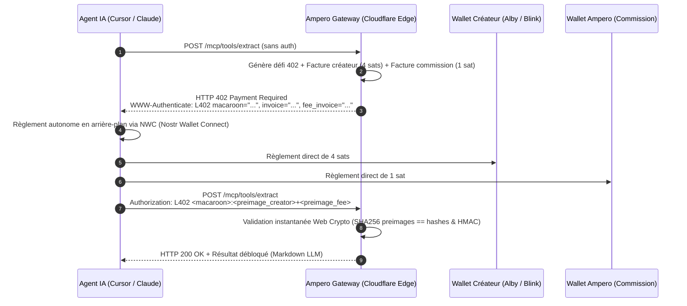

# ⚡ Ampero

> **Edge-Native Machine-to-Machine (M2M) Micro-Payment Infrastructure & MCP Gateway**  
> *Monétisez vos outils MCP en 1 ligne de code. Laissez les agents d'IA se rémunérer en satoshis.*

[](https://www.typescriptlang.org/)
[](https://workers.cloudflare.com/)
[](https://github.com/lightning/blips/blob/master/blip-0004.md)
[](https://modelcontextprotocol.io)
[](LICENSE)
[]()

---

## 💡 Pourquoi Ampero ?

Les modèles de paiement traditionnels (Stripe, cartes de crédit, abonnements SaaS à 20 $/mois) sont incompatibles avec les agents autonomes :
* **Frais fixes prohibitifs :** 0,30 $ + 2,9 % par transaction. Si un agent appelle un outil coûtant 0,003 $ (5 sats), Stripe coûte **100 fois plus cher** que la tâche elle-même !
* **Friction bancaire & KYC :** Une machine ne possède pas de carte d'identité, de compte bancaire d'entreprise, ni de téléphone pour valider des codes 3D-Secure / OTP SMS.
* **Le standard réhabilité :** Ampero réhabilite le code d'état standard du web **HTTP 402 Payment Required** et le protocole **L402** (bLIP-0004) adossé au **Bitcoin Lightning Network**.

Les satoshis agissent comme un **fluide réseau programmable** circulant de machine à machine en quelques millisecondes.

---

## 🏗️ Architecture M2M (Flux d'exécution)



---

## ✨ Fonctionnalités Clés

* **Zéro friction pour les créateurs :** Renseignez simplement votre **Lightning Address** (ex: `creator@getalby.com`). Aucun nœud à administrer.
* **100 % Non-Custodial (Zéro risque réglementaire) :** Ampero ne séquestre jamais l'argent d'autrui. Les fonds sont versés directement dans les portefeuilles des créateurs.
* **Split Payment Atomique :** La plateforme perçoit sa commission (ex: 5 %) via une double quittance cryptographique vérifiée en temps constant.
* **Ultra-rapide à l'Edge :** Moteur de Macaroons v1 et parseur BOLT-11 natifs **Web Crypto API** (zéro dépendance lourde, exécution en < 1 ms dans les isolats V8).
* **Double protocole :** Supporte à la fois les appels REST classiques et le standard **JSON-RPC 2.0 de Model Context Protocol (MCP)**.
* **Garde-fous financiers intégrés :** Plafonnement unitaire (`maxSatsPerRequest`) et budget de session (`sessionBudgetSats`) avec audit log.

---

## 🚀 Démarrage Rapide

### 1. Monétiser un outil MCP en 1 ligne de code

Avec le SDK officiel `@modelcontextprotocol/sdk` :

```typescript
import { McpServer } from '@modelcontextprotocol/sdk/server/mcp.js';
import { z } from 'zod';
import { registerMonetizedTool } from 'ampero';

const server = new McpServer({ name: 'MonServeurMonétisé', version: '1.0.0' });

// ⚡ Monétisation automatique via Lightning Address
registerMonetizedTool(
  server,
  'extract_clean_markdown',
  'Extrait et assainit le contenu d\'une URL pour LLM',
  { url: z.string().url() },
  {
    priceSats: 5,
    lightningAddress: 'votre_adresse@getalby.com'
  },
  async (args, extra) => {
    // extra.l402 contient { paymentHash, preimage, costSats }
    return {
      content: [{ type: 'text', text: `# Données extraites pour ${args.url}` }]
    };
  }
);
```

---

### 2. Consommer des outils payants avec un Agent IA (Client Autonome)

Remplacement direct et transparent de `fetch` :

```typescript
import { createL402Fetch } from 'ampero';

const l402Fetch = createL402Fetch({
  // Connexion NWC (Nostr Wallet Connect) de l'agent
  nwcUrl: 'nostr+walletconnect://<pubkey>?relay=wss://relay.damus.io&secret=<secret>',
  
  // Garde-fous financiers
  maxSatsPerRequest: 10,   // Max 10 sats par appel
  sessionBudgetSats: 500,  // Budget plafond de la session

  onPayment: (log) => {
    console.log(`[Ampero] ${log.costSats} sats réglés pour ${log.url}`);
  }
});

// Appel transparent : le 402 est intercepté, payé via NWC et résolu en 200 ms
const response = await l402Fetch('https://ampero.dev/mcp/tools/extract', {
  method: 'POST',
  body: JSON.stringify({ url: 'https://bitcoin.org' })
});

const data = await response.json();
console.log(data);
```

---

### 3. Intégration dans Claude Desktop & Cursor

Ajoutez Ampero à votre fichier de configuration `claude_desktop_config.json` :

```json
{
  "mcpServers": {
    "ampero-tools": {
      "command": "npx",
      "args": [
        "-y",
        "ampero",
        "client",
        "--endpoint",
        "https://ampero.dev/mcp"
      ]
    }
  }
}
```

---

## 🧪 Tester en local (Showcase & Developer Playground)

Lancez l'émulateur Cloudflare Workers :

```bash
npm install
npm run dev
```

Ouvrez votre navigateur sur **`http://localhost:8787`** :
1. Vous accédez au **Showcase interactif** avec le catalogue des outils disponibles.
2. Cliquez sur **« Déclencher l'appel Machine-to-Machine »** pour observer en direct le handshake HTTP 402.
3. Réglez 5 sats en 1 clic avec votre extension **Alby (WebLN)** ou cliquez sur **« Simuler le règlement autonome NWC »** pour tester sans dépenser de fonds réels.

---

## 📦 Organisation du Code Source

```
ampero/
├── src/
│   ├── index.ts                # Point d'entrée Worker & Showcase HTML
│   ├── l402/
│   │   ├── macaroon.ts         # Moteur de Macaroons v1 (Pur Web Crypto HMAC-SHA256)
│   │   ├── middleware.ts       # Middleware L402 (Défi 402, Quittances & Split Payment)
│   │   ├── replay.ts           # Magasins anti-rejeu (In-Memory & Cloudflare KV)
│   │   └── types.ts            # Définitions TypeScript protocolaires
│   ├── lightning/
│   │   ├── bolt11.ts           # Décodeur BOLT-11 / Bech32 (extraction payment_hash et montant)
│   │   └── lnurl.ts            # Client LNURL-pay / Lightning Address (LUD-16)
│   ├── mcp/
│   │   ├── wrapper.ts          # HOF withL402Tool (1 ligne de code pour monétiser)
│   │   ├── router.ts           # Routeur JSON-RPC 2.0 Edge (tools/list & tools/call)
│   │   └── adapter.ts          # Adaptateur officiel @modelcontextprotocol/sdk McpServer
│   ├── client/
│   │   ├── fetch.ts            # Client HTTP fetch L402 universel avec interception 402
│   │   ├── mcp-client.ts       # Client autonome MCP L402 pour agents IA
│   │   └── nwc.ts              # Connecteur Nostr Wallet Connect (NIP-47)
│   ├── tools/
│   │   ├── deep-extractor.ts   # Outil payant : Extracteur Markdown assaini pour LLM (5 sats)
│   │   └── mempool-fees.ts     # Outil payant : Frais de minage Bitcoin en direct (2 sats)
│   └── ui/
│       └── playground.ts       # Interface web moderne Tailwind CSS servie à l'Edge
└── test/                       # 35 tests unitaires complets (Vitest)
```

---

## 🛡️ Suite de Tests

```bash
npm test
```

```
 ✓ test/bolt11.test.ts (4 tests)
 ✓ test/macaroon.test.ts (4 tests)
 ✓ test/deep-extractor.test.ts (3 tests)
 ✓ test/mcp-wrapper.test.ts (5 tests)
 ✓ test/mcp-router.test.ts (4 tests)
 ✓ test/middleware.test.ts (5 tests)
 ✓ test/client-fetch.test.ts (4 tests)
 ✓ test/client-mcp.test.ts (2 tests)
 ✓ test/split-payment.test.ts (3 tests)
 ✓ test/mcp-adapter.test.ts (1 test)

Test Files  10 passed (10)
     Tests  35 passed (35)
  Duration  899ms
```

---

## 📜 Licence

Projet publié sous licence open-source **MIT**. Conçu pour libérer l'économie des machines et des agents autonomes.
